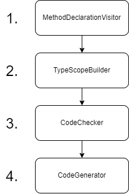
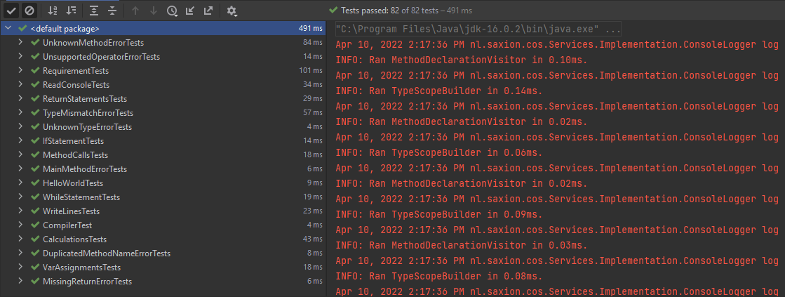

# B# <!-- omit in toc -->

A simple programming language that compiles to Jasmin bytecode.
This language was created as a university project for the course "Compilers and Operating Systems".
It has been made to mimic C# syntax.

## Table of Contents <!-- omit in toc -->

- [Grammar](#grammar)
- [Data](#data)
  - [Types](#types)
- [Compiler](#compiler)
  - [Visitors](#visitors)
    - [MethodDeclarationVisitor](#methoddeclarationvisitor)
    - [TypeScopeBuilder](#typescopebuilder)
    - [CodeChecker](#codechecker)
    - [CodeGenerator](#codegenerator)
      - [Optimizations](#optimizations)
- [Testing](#testing)
- [Keywords](#keywords)
- [Operators](#operators)
- [B# Features](#b-features)
  - [Provided methods](#provided-methods)
    - [WriteLine](#writeline)
    - [ReadConsoleBool](#readconsolebool)
    - [ReadConsoleInt](#readconsoleint)
    - [ReadConsoleFloat](#readconsolefloat)
    - [ReadConsoleLine](#readconsoleline)
    - [RandomInt](#randomint)
  - [Calculation expressions](#calculation-expressions)
  - [Bool expressions](#bool-expressions)
    - [AND / OR](#and--or)
    - [Bang operator TODO](#bang-operator-todo)
  - [Variables](#variables)
    - [Var](#var)
    - [Variable assignments](#variable-assignments)
  - [If statements](#if-statements)
  - [While loop](#while-loop)
  - [Methods](#methods)
- [Examples](#examples)
  - [Good weather examples](#good-weather-examples)
  - [Bad weather examples](#bad-weather-examples)

## Grammar

To compile B# code, a `ParseTree` is needed. For this, a grammar was written in [ANTLR](https://www.antlr.org/). The grammar is split into two parts: the `Lexer` grammar and the `Parser` grammar. The `Lexer` converts the **B#** text into the correct tokens, and then the `Parser` processes those tokens to build the `ParseTree`.

## Data

The most important part of the **B#** language is that everything is an expression if it has a value or returns a value. This makes it possible, for example, to pass methods as parameters.

### Types

The B# language supports the following data types:
* int  
* float  
* bool  
* string  
* char  

## Compiler

The compiler uses the [visitor pattern](https://en.wikipedia.org/wiki/Visitor_pattern) to walk through the `ParseTree`. First, the code is checked for correctness, and then the `CodeGenerator` generates Jasmin bytecode.

### Visitors

The **B#** language uses multiple visitors to allow for extensive error checking. Below is the order in which all visitors are executed.



#### MethodDeclarationVisitor

The `MethodDeclarationVisitor` inspects all methods defined in the code. This is needed so that other visitors can look up which methods exist and what their return types are.

#### TypeScopeBuilder

After storing the defined methods, the `ParseTree` is walked again to build the correct scopes. During scope construction, the stack size for each scope is also calculated. This is later used to set the correct stack and local sizes in the Jasmin bytecode. The `TypeScopeBuilder` also tracks all types of methods, parameters, and variables so that the `CodeChecker` can use this during type validation.

#### CodeChecker

The `CodeChecker` verifies the entire code to ensure everything is correct. For example, it checks whether an expression in an `if` statement returns a `bool`, and whether a variable exists.

Below is a complete list of errors the `CodeChecker` can generate.

##### Type errors <!-- omit in toc -->

| Error name | Message | Description |
|---|---|---|
| `UnknownTypeTemp` | ... does not have a known type. | A variable or method has a type that does not exist or was not found. |
| `TypeMismatchTemp` | Types do not match, ... ... | The expected types do not match. |

##### Method errors <!-- omit in toc -->

| Error name | Message | Description |
|---|---|---|
| `MissingMainTemp` | No Main method has been found. | The compiler could not find a `Main` method. A B# program must always contain a `Main` method. |
| `MainParamsTemp` | The Main method can not have any parameters. | The `Main` method may not have parameters. |
| `DuplicatedMethodNamesTemp` | Multiple methods found with the same identifier of ... | In B#, multiple methods with the same name are not allowed. |
| `UnknownMethodTemp` | Method ... does not exist. | The method does not exist in the code. |
| `MissingReturnTemp` | Method ... is missing a return statement. | The method has no return statement in the highest scope. |
| `WriteLineClassTemp` | Unable to print a .. to the console. | The `WriteLine` method cannot print a certain value to the console. |

##### Variable errors <!-- omit in toc -->

| Error name | Message | Description |
|---|---|---|
| `IncorrectVariableTypeTemp` | ... can not be used for variable ... | The type of an expression does not match the variable type. |
| `NotAVariableTemp` | ... is not a variable. | The symbol is not a variable. Use `()` after the identifier if it's a method. |
| `VarNotInitializedTemp` | ... has not been initialized yet. | The variable has no assigned value. |
| `DuplicatedVarNamesTemp` | Multiple variables found with the same identifier of ... in the same scope. | Variables with the same name were found in the current scope. |
| `UnknownVariableTemp` | Variable ... does not exist in the current scope. | The variable does not exist in the current or parent scopes. |
| `VarExpectedTemp` | Its only possible to assign a value to a variable. | The identifier was not a variable. Only variables can be assigned values. |

##### Misc errors <!-- omit in toc -->

| Error name | Message | Description |
|---|---|---|
| `UnsupportedOperatorTemp` | ... does not support the ... operator. | The used data type does not support this operator. |

#### CodeGenerator

The `CodeGenerator` is the final step in the compilation process. It generates Jasmin bytecode once the `CodeChecker` confirms no errors were found.

##### Optimizations

###### **Stack size** <!-- omit in toc -->

During scope creation, the required stack size for the Jasmin bytecode is calculated. This ensures methods use as little memory as possible.

###### **Value pushing** <!-- omit in toc -->

When pushing a value onto the stack, the compiler checks whether the value falls within a certain range so it can use the most efficient instruction. For example, pushing the int value `4` uses `iconst_4` instead of `ldc 4`.

## Testing

For all [B# features](#b-features), unit tests have been written. There are **82** unit tests in total: **30** bad weather tests and **52** good weather tests. These include tests for both the `CodeChecker` and the `CodeGenerator`. All B# test files can be found in the `testFiles` folder.



## Keywords

* int  
* float  
* bool  
* string  
* char  
* return  
* void  
* while  
* if  
* else  
* var  
* true  
* false  
* WriteLine  
* ReadConsoleInt  
* ReadConsoleLine  
* ReadConsoleFloat  
* ReadConsoleBool  
* RandomInt  

## Operators

* =  
* ==  
* !=  
* \>  
* \>=  
* <  
* <=  
* !  
* &&  
* ||  
* +  
* -  
* *  
* /  
* %  

## B# Features

### Provided methods
The **B#** language provides several built-in methods that can be used anywhere.

#### WriteLine
The `WriteLine` method prints an expression to the console. The expression must be one of the following types: `int`, `float`, `bool`, `char`, or `string`.

```csharp
void Main()
{
    WriteLine("Hello World!");
}
```

*Output*
```
Hello World!
```

#### ReadConsoleBool
Reads a `bool` input from the console.

```csharp
void Main(){
    WriteLine(ReadConsoleBool());
    WriteLine(ReadConsoleBool());
}
```

*Input*
```
true
false
```

*Output*
```
true
false
```

#### ReadConsoleInt
Reads an `int` input from the console.

```csharp
void Main(){
    WriteLine(ReadConsoleInt());
}
```

*Input*
```
1
```

*Output*
```
1
```

#### ReadConsoleFloat
Reads a `float` input from the console.

```csharp
void Main(){
    WriteLine(ReadConsoleFloat());
}
```

*Input*
```
1.123
```

*Output*
```
1.123
```

#### ReadConsoleLine
Reads a `string` input from the console.

```csharp
void Main(){
    WriteLine(ReadConsoleLine());
}
```

*Input*
```
Hello World!
```

*Output*
```
Hello World!
```

#### RandomInt
The `RandomInt` method returns a random `int` between `-2147483648` and `2147483647` when no maximum is given. If a maximum is provided, the result is between `0` and the maximum.

```csharp
void Main(){
    WriteLine(RandomInt());

    var max = 10;
    WriteLine(RandomInt(max));
}
```

*Output*
```
1246365382
6
```

### Calculation expressions
Calculation expressions can compute values using `float`s or `int`s. The two types cannot be mixed in the same expression. Supported operators: `%`, `*`, `/`, `+`, `-`.

```csharp
void Main()
{
    WriteLine(10.1 + (3.123 + 5.12 * 6.65 / (5.45 * 2.23) - 6.43));
    WriteLine(10 + (3 + 5 * 6 / (5 * 2) - 6 % 2) * 123  + 1);
}
```

*Output*
```
9.594498
749
```

### Bool expressions
Bool expressions allow comparing two expressions of type `int`, `float`, `bool`, `char`, or `string`. Different types cannot be compared.

```csharp
void Main()
{
    WriteLine(123 + 123 == 246 && "test" == "test");
}
```

*Output*
```
true
```

#### AND / OR
The `&&` and `||` operators compare two `bool` expressions.  
* `||` only evaluates the second expression if the first is `false`.  
* `&&` only evaluates the second expression if the first is `true`.

```csharp
void Main()
{
    WriteLine(TrueMethod() || FalseMethod());
    WriteLine(TrueMethod() && FalseMethod());
}

bool TrueMethod(){
    WriteLine("Hello from inside TrueMethod().");
    return true;
}

bool FalseMethod(){
    WriteLine("Hello from inside FalseMethod().");
    return false;
}
```

*Output*
```
Hello from inside TrueMethod().
true
Hello from inside TrueMethod().
Hello from inside FalseMethod().
false
```

#### Bang operator TODO

```csharp
void Main()
{
    WriteLine(!true);
}
```

```
false
```

### Variables
Variables can be created using the types `int`, `float`, `bool`, `char`, or `string`.

```csharp
void Main()
{
    string text = "This is a string value stored in a string var.";
    WriteLine(text);
    int number = 123;
    WriteLine(number);
}
```

*Output*
```
This is a string value stored in a string var.
123
```

#### Var
Variables can also be created using the `var` keyword, but must be initialized immediately.

```csharp
void Main()
{
    var text = "This is a string value stored in a var.";
    WriteLine(text);
    var number = 123;
    WriteLine(number);
}
```

*Output*
```
This is a string value stored in a var.
123
```

#### Variable assignments
Variables can be created and assigned in multiple ways.

```csharp
void Main(){
    int test0 = 321;
    WriteLine(test0);

    // Assigning one value to multiple variables at once.
    int test1;
    int test2;
    int test3;

    test3 = test2 = test1 = IntMethod();

    WriteLine(test1);
    WriteLine(test2);
    WriteLine(test3);

    // Creating a variable and then assigning a value.
    int test4;
    WriteLine(test4 = 123);
    WriteLine(test4);

    int test5;
    test5 = 6754;
    WriteLine(test5);

    // Initializing multiple variables at once.
    int test6 = 43, test7 = 1, test8 = 456;
    WriteLine(test6);
    WriteLine(test7);
    WriteLine(test8);

}

int IntMethod(){
    return 100;
}
```

*Output*
```
321
100
100
100
123
123
6754
```

### If statements
An `if` statement requires a `bool` expression.

```csharp
void Main()
{
    int number1 = 1;
    int number2 = 10;
    bool madeMistake = number1 > number2 || number2 < 0;
    if (madeMistake) {
        WriteLine("You made a mistake");
    } else {
        WriteLine(madeMistake);
    }
    bool isCorrect = number1 > number2 && number2 < 0;
    if (isCorrect) {
        WriteLine("true");
    } else {
        WriteLine("false");
    }
}
```

*Output*
```
false
false
```

### While loop
A while loop requires a `bool` expression.

```csharp
void Main(){
    var amount = 3;
    var counter = 0;
    while(counter < amount) {
        WriteLine("Hello World!");
        counter = counter + 1;
    }
}
```

*Output*
```
Hello World!
Hello World!
Hello World!
```

### Methods
Custom methods can be created in **B#**. Methods must specify a return type: `int`, `float`, `bool`, `char`, `string`, or `void`.  
`void` is used when a method does not return anything.

Method parameters must also have one of the above types.

```csharp
void Main()
{
    LinearCongruentialGenerator(10, 5);
}

void LinearCongruentialGenerator(int amountOfNumbers, int seed){
    var previous = seed;
    var mod = 7;
    var inc = 3;
    var multiplier = 3;

    var counter = 0;
    while(counter < amountOfNumbers){
        counter = counter + 1;
        WriteLine(previous = ((previous * multiplier) + inc) % mod );
    }
}
```

*Output*
```
4
1
6
0
3
5
4
1
6
0
```

## Examples

Below are several additional example programs in **B#**, containing both valid and invalid programs.

### Good weather examples

#### 1. <!-- omit in toc -->

Hello World in B#.

```csharp
void Main()
{
    WriteLine("Hello World!");
}
```

#### 2. <!-- omit in toc -->

Simple example of `if` statements and `bool` expressions.

```csharp
void Main()
{
    int number1 = ReadConsoleInt(), number2 = ReadConsoleInt();
    if (number1 > number2 || number2 < 0) {
        WriteLine("You made a mistake");
    } else {
        WriteLine(false);
    }

    WriteLine(number1 > number2 && number2 < 0);
}
```

#### 3. <!-- omit in toc -->

Simple calculation example.

```csharp
void Main()
{
    int number = 3 + 5 * 6 / (5 * 2) - 6;
    number = number + 10;
    WriteLine(number);
}
```

#### 4. <!-- omit in toc -->

Example of creating multiple `var` variables.

```csharp
void Main()
{
    var character = 'a', num1 = 1, num2 = 1, text = "Hello World!";
    WriteLine(character);
    WriteLine(num1 + num2);
    WriteLine(text);
}
```

#### 5. <!-- omit in toc -->

FizzBuzz in B#.

```csharp
void Main()
{
    int i = 1;
    while(i < 100)
    {
        if (i % 3 == 0 && i % 5 == 0)
        {
            WriteLine("FizzBuzz");
        }
        else if (i % 3 == 0)
        {
           WriteLine("Fizz");
        }
        else if (i % 5 == 0)
        {
           WriteLine("Buzz");
        }

        i = i + 1;
    }
}
```

### Bad weather examples

#### 1. <!-- omit in toc -->

`Main` may not have parameters.

```csharp
void Main(int number){

}
```

#### 2. <!-- omit in toc -->

All B# programs must contain a `Main` method.

```csharp
void notMain(){

}
```

#### 3. <!-- omit in toc -->

Methods may not share the same name. Method names must be unique!

```csharp
void Main(){
    Number();
}

void Number(){

}

void Number(){

}
```

#### 4. <!-- omit in toc -->

A non-`void` method must contain a `return` statement.

```csharp
void Main(){
    WriteLine(Number());
}

int Number(){

}
```

#### 5. <!-- omit in toc -->

`string` does not support the `+` operator.

```csharp
void Main(){
    WriteLine("test " + "test");
}
```
